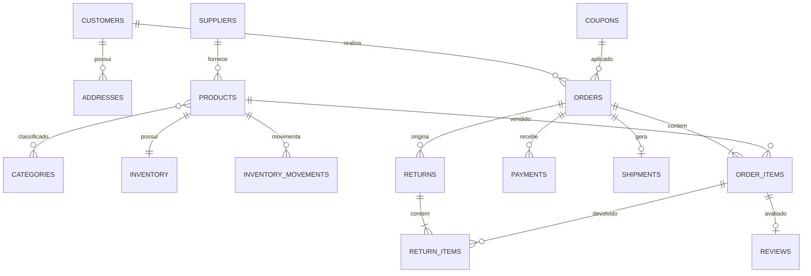

# SQL Analytics Lab

Laboratório completo de MySQL 8 para demonstrar modelagem, integridade, SQL analítico, objetos de banco, transações, testes e desempenho. O banco é o produto principal: não há ORM nem frontend escondendo as consultas.

O cenário é um marketplace fictício com clientes, endereços, fornecedores, categorias, produtos, estoque, pedidos, pagamentos, entregas, devoluções, cupons e avaliações.

## O que este projeto demonstra

- modelagem conceitual, lógica e física normalizada;
- migrations SQL incrementais e scripts versionados;
- PKs, FKs, uniques, checks, defaults e índices compostos;
- dinheiro com `DECIMAL`, histórico de preço e movimentação de estoque;
- seed determinístico e seguro, sem dados pessoais reais;
- consultas básicas, intermediárias e avançadas;
- CTEs, subconsultas, `LAG`, `LEAD`, rankings e curvas ABC;
- views, functions, procedures e triggers com uso justificado;
- transações, bloqueio de linha, commit e rollback;
- testes SQL que interrompem a execução quando uma regra falha;
- `EXPLAIN ANALYZE` reproduzível antes e depois dos índices;
- Docker Compose e validação contínua no GitHub Actions.

## Início rápido

Pré-requisito: Docker com o plugin Compose.

```bash
cp .env.example .env
./scripts/run-all.sh
```

Esse único comando:

1. inicia o MySQL 8.4;
2. aguarda o healthcheck;
3. recria o banco;
4. aplica as migrations na ordem;
5. carrega o seed;
6. cria functions, procedures, triggers e views;
7. executa todos os testes SQL.

O MySQL fica disponível em `localhost:3311` por padrão.

## Comandos

| Comando | Resultado |
|---|---|
| `make up` | inicia somente o MySQL |
| `make reset` | recria estrutura, objetos e dados |
| `make test` | executa os testes no banco atual |
| `make verify` | recria tudo e testa do zero |
| `make plans` | coleta planos antes/depois dos índices |
| `make shell` | abre o cliente MySQL dentro do container |
| `make down` | encerra o container preservando o volume |
| `make clean` | encerra e remove o volume local |

Também é possível usar os scripts diretamente, sem `make`.

## Conexão de demonstração

Os valores padrão estão em `.env.example`:

```text
host: localhost
port: 3311
database: sql_analytics_lab
user: analytics
password: analytics_password
```

Use essas credenciais apenas localmente. O usuário `analytics` recebe permissões de leitura e execução necessárias para explorar o laboratório, sem privilégios administrativos globais.

## Dados determinísticos

O seed recria sempre o mesmo cenário:

| Entidade | Volume |
|---|---:|
| Clientes e endereços | 150 |
| Fornecedores | 10 |
| Categorias | 12 |
| Produtos e saldos de estoque | 120 |
| Pedidos | 720 |
| Itens de pedido | 1.440 |
| Período principal | agosto/2024 a julho/2026 |

Há estados variados de pedido, entregas pontuais e atrasadas, devoluções, avaliações, cupons usados/não usados, produtos inativos e cenários de estoque baixo.

O seed começa limpando as tabelas com as FKs temporariamente desativadas e repopula IDs e valores fixos. Assim, executá-lo após a estrutura produz o mesmo estado inicial.

## Estrutura

```text
migrations/            tabelas, restrições e índices incrementais
seeds/                 dados determinísticos do marketplace
queries/basic/         filtros e joins fundamentais
queries/intermediate/  agregações e análises operacionais
queries/advanced/      CTEs, janelas, rankings e taxas
views/                 sete views reutilizáveis
functions/             desconto e segmentação de cliente
procedures/            pedido, cancelamento e reposição transacionais
triggers/              histórico de preço e auditoria
performance/           consultas, índices e coleta de planos
tests/                 asserções, integridade, objetos e rollback
scripts/               criação, reset, teste e desempenho
docs/                  modelos, dicionário e explicações
```

## Modelo de dados



O [modelo detalhado](docs/DATA_MODEL.md) explica os níveis conceitual, lógico e físico, a normalização até 3FN e as desnormalizações intencionais. O [dicionário de dados](docs/DATA_DICTIONARY.md) resume todas as tabelas e views.

## Consultas analíticas

Cada arquivo pode ser executado pelo cliente MySQL:

```bash
docker compose exec -T mysql sh -c \
  'MYSQL_PWD="$MYSQL_PASSWORD" mysql -u"$MYSQL_USER" "$MYSQL_DATABASE"' \
  < queries/advanced/01_month_over_month_revenue.sql
```

As análises incluem:

- faturamento mensal e ticket médio;
- produtos mais vendidos e mais devolvidos;
- categorias com maior receita;
- clientes novos, recorrentes e sem compra recente;
- pedidos atrasados e tempo médio de entrega;
- taxas mensais de cancelamento e devolução;
- estoque baixo e produtos parados;
- desempenho observacional de cupons;
- ranking de clientes com window functions;
- comparação mensal usando `LAG` e `LEAD`;
- curva ABC de clientes e produtos;
- margem por fornecedor usando o custo histórico do item.

O [guia de consultas](docs/QUERY_GUIDE.md) explica o problema, a técnica e a solução de cada consulta avançada.

## Objetos SQL

### Views

- `v_order_financials`: receita, custo e margem por pedido.
- `v_monthly_revenue`: faturamento, clientes e ticket por mês.
- `v_customer_360`: frequência, LTV, ticket e recência.
- `v_product_performance`: venda, devolução, avaliação e giro.
- `v_inventory_health`: saldo disponível e risco de ruptura.
- `v_delivery_performance`: prazo e pontualidade por transportadora.
- `v_coupon_performance`: descontos e receita por cupom.

### Functions

- `fn_coupon_discount`: calcula desconto fixo/percentual, teto e limite pelo subtotal.
- `fn_customer_segment`: classifica cliente como prospect, novo, recorrente, VIP ou inativo.

### Procedures

- `sp_create_order`: bloqueia estoque, valida itens/cupom, grava snapshots, reduz saldo e confirma tudo na mesma transação.
- `sp_cancel_order`: valida o estado, restaura estoque, ajusta pagamento/cupom e audita.
- `sp_restock_product`: bloqueia o saldo, repõe e registra o movimento.

Exemplo de criação controlada:

```sql
SET @new_order_id = NULL;
CALL sp_create_order(
  1,
  1,
  'BEMVINDO10',
  18.90,
  JSON_ARRAY(
    JSON_OBJECT('productId', 2, 'quantity', 1),
    JSON_OBJECT('productId', 9, 'quantity', 2)
  ),
  @new_order_id
);
SELECT @new_order_id;
```

### Triggers

Os triggers foram limitados a casos transversais:

- alteração de preço gera histórico automaticamente;
- movimento de estoque gera auditoria;
- mudança de estado do pedido gera histórico e auditoria.

Regras do fluxo principal continuam explícitas nas procedures e constraints, evitando lógica invisível em excesso.

## Integridade e transações

Exemplos protegidos pelo banco:

- quantidade de item zero;
- preço de venda inferior ao custo;
- endereço sem cliente;
- estoque reservado maior que o saldo físico;
- avaliação fora de 1–5;
- pedido cujo total não fecha a equação financeira;
- cancelamento sem data e motivo;
- estoque negativo ou relacionamento órfão.

As procedures usam transação, `FOR UPDATE`, `COMMIT`, `ROLLBACK` e `RESIGNAL`. O [documento de transações](docs/TRANSACTIONS.md) explica o teste de falha segura e a disputa concorrente por estoque.

## Testes SQL

```bash
./scripts/run-tests.sh
```

Os testes criam asserções que usam `SIGNAL SQLSTATE '45000'`: qualquer resultado incorreto encerra o comando com erro. A suíte verifica:

- volumes determinísticos do seed;
- rejeição de quantidades, preços e FKs inválidos;
- consistência do faturamento da view com os pedidos;
- cenários de estoque baixo;
- limites de desconto;
- reposição, criação e cancelamento de pedido;
- histórico de preços e auditoria;
- rollback integral após falha no meio da transação.

## Desempenho

Com o banco criado:

```bash
./scripts/collect-plans.sh
```

O script remove cinco índices relevantes, coleta `EXPLAIN ANALYZE`, recria os índices e coleta novamente. Os tempos não são versionados nem inventados; os resultados da sua máquina aparecem em `performance/results/before.txt` e `after.txt`.

Consulte [docs/PERFORMANCE.md](docs/PERFORMANCE.md) para a justificativa de seletividade e leitura dos planos.

## Migrations

| Arquivo | Conteúdo |
|---|---|
| `001_master_data.sql` | clientes, catálogo, estoque, cupons e históricos |
| `002_commerce.sql` | pedidos, itens, pagamentos, entregas, devoluções e auditoria |
| `003_performance_indexes.sql` | índices ligados a consultas concretas |

Para mudar o esquema, adicione uma migration nova em vez de editar um banco manualmente.

## CI

O workflow `.github/workflows/sql-validation.yml` sobe `mysql:8.4` como service container e executa `./scripts/run-all.sh`. Um erro de sintaxe, constraint, resultado ou procedure deixa o job vermelho.

## Execução sem Docker

Com MySQL Server/Client 8.4 disponíveis, informe o host e execute o mesmo fluxo:

```bash
export MYSQL_HOST=127.0.0.1
export MYSQL_TCP_PORT=3306
export MYSQL_ROOT_PASSWORD=root_password
export MYSQL_DATABASE=sql_analytics_lab
export MYSQL_USER=analytics
export MYSQL_PASSWORD=analytics_password
./scripts/run-all.sh
```

## Decisões importantes

- MySQL 8.4 foi escolhido para usar constraints, CTEs, funções de janela e `EXPLAIN ANALYZE` de forma explícita.
- `DECIMAL(13,2)` preserva precisão monetária.
- Preço e custo são congelados no item do pedido para relatórios históricos corretos.
- A categoria principal evita dupla contagem de receita em produtos multcategoria.
- Consultas de cupom são comparações observacionais; não alegam que o cupom causou aumento de ticket.
- A data de corte padrão das consultas é a referência do seed e pode ser alterada por variável.

## Licença

Distribuído sob a licença MIT. Consulte [LICENSE](LICENSE).
