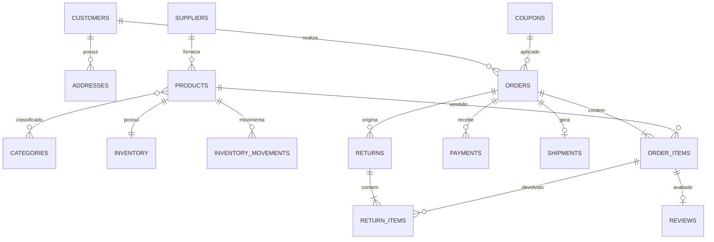

# Modelo de dados

## Modelo conceitual

O marketplace possui cinco áreas de negócio:

1. **Clientes:** cliente e seus endereços.
2. **Catálogo:** fornecedor, produto e categorias.
3. **Estoque:** saldo atual, ponto de reposição e histórico de movimentos.
4. **Venda:** pedido, itens, cupom e pagamento.
5. **Pós-venda:** entrega, devolução, avaliação e auditoria.

## Modelo lógico

As relações N:N foram resolvidas por tabelas associativas:

- `product_categories` relaciona produtos e categorias e identifica a categoria principal.
- `order_items` relaciona pedido e produto, preservando nome, SKU, preço e custo da data da compra.
- `return_items` relaciona a devolução com os itens efetivamente adquiridos.

O histórico não depende do estado atual:

- `product_price_history` registra alterações de preço.
- `inventory_movements` registra entradas e saídas com saldo posterior.
- `order_status_history` registra as transições de pedido.
- `audit_log` armazena eventos técnicos relevantes em JSON.

## Normalização

O núcleo está em terceira forma normal (3FN): atributos dependem da chave da própria entidade e dados repetidos foram separados. Existem duas desnormalizações intencionais:

- `order_items.product_sku` e `product_name`: snapshot comercial para que uma alteração futura do produto não reescreva o pedido histórico.
- `inventory.quantity_on_hand`: saldo materializado para operação transacional rápida; `inventory_movements` continua sendo a trilha de auditoria.

Essas decisões evitam joins ou reconstruções caras no fluxo operacional sem prejudicar a rastreabilidade.

## Modelo físico

- Engine InnoDB para transações, bloqueios de linha e chaves estrangeiras.
- `BIGINT UNSIGNED` nas chaves, permitindo crescimento sem valores negativos.
- `DECIMAL(13,2)` para dinheiro; nunca `FLOAT` ou `DOUBLE`.
- `DATETIME(6)` em UTC para eventos e `DATE` para datas sem horário.
- `ENUM` para conjuntos de estados pequenos e controlados.
- `CHECK` para quantidades, avaliações, intervalos, margem e equação financeira.
- Índices compostos seguem os filtros e a ordenação das consultas analíticas.

## Integridade

- Estoque não aceita valores negativos porque usa `INT UNSIGNED`.
- A quantidade reservada não pode superar a quantidade disponível.
- Item de pedido e item devolvido exigem quantidade positiva.
- E-mail, SKU, código do pedido, cupom, CNPJ fictício e rastreio são únicos.
- Pedido exige `total = subtotal - desconto + frete`.
- Pedido cancelado exige instante e motivo.
- Avaliação fica entre 1 e 5 e deve apontar para uma compra existente.
- Chaves estrangeiras impedem relacionamentos órfãos.
